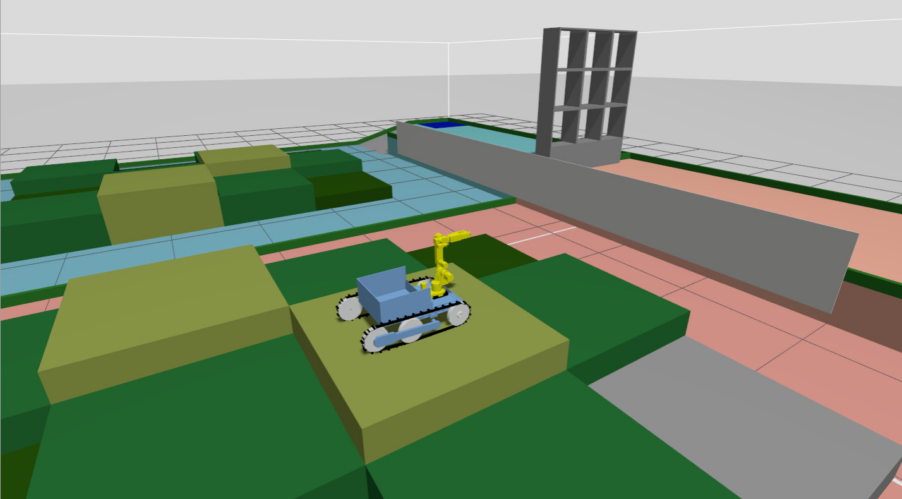
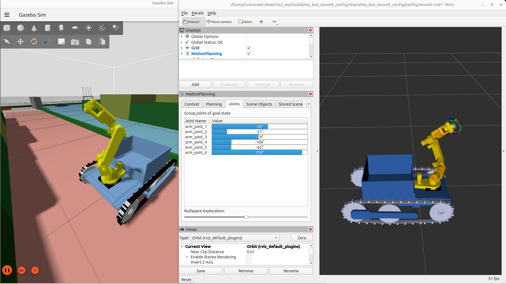

# Robocon 2026: Round 1 Ideation

**Author:** Rudraneel Shee

**NOTE: This is not the final repo. Will update soon.**

## Objectives
The main objective is to learn the following ROS2 related subtasks:
* **Robot Modeling:** Generating a complete URDF from CAD models for a custom tracked wheel drive mechanism
* **Simulation:** Spawning the complete mobile manipulator within a custom Robocon Gazebo world
* **Motion Planning:** Configuring the MoveIt 2 package for precise, collision-aware control of the robotic arm

## Features
* **Robot Description:** Custom URDF (Xacro) integrating a 6-DOF AR4 arm onto a custom tracked wheel drive chassis.
* **Physics Simulation:** Gazebo (Harmonic) integration with `gz_ros2_control` and accurate joint dynamics.
* **Motion Planning:** MoveIt 2 configuration with collision-aware inverse kinematics (OMPL) and time-optimal trajectory generation.
* **World:** Custom Robocon arena loaded via SDF.

## Visuals

### Bot Locomotion
Click to watch the video
[](./media/teleop_driving.mp4)

### Robotic Arm Movement
Click to watch the video
[](./media/moveit_roboticarm.mp4)

## Dependencies
Ensure you have the following installed:
* ROS 2 Jazzy
* Gazebo (Harmonic)
* MoveIt 2 (`sudo apt install ros-jazzy-moveit`)
* `ros_gz` bridge packages
* `annin_ar4_description` (Required for AR4 arm meshes)

## Build Instructions
Clone this repository into the `src` folder of your ROS 2 workspace:
```bash
cd ~/ros2_ws/src
git clone https://github.com/EigenRudra/robocon26-ros2-customURDF-MoveIt.git
cd ~/ros2_ws
colcon build --symlink-install
source install/setup.bash
```

## Usage
Launch the complete simulation stack (Gazebo, `ros2_control`, MoveIt, and RViz) perfectly synchronized to simulation time:

```bash
ros2 launch my_bot_updated full_sim.launch.py
```

Use the interactive marker in RViz to set a goal pose for the arm, click Plan, and click Execute to see the simulated arm move in Gazebo.

To drive the bot around the arena, run the following in a new terminal
```bash
ros2 run teleop_twist_keyboard teleop_twist_keyboard
```

## Issues and Limitations
Working on fixing the following issues:
* Proper tracked wheel drive mechanism could not be simulated in Gazebo. Currently, the tracks are fixed and not moving.
* The bot is unable to climb the Mehuia forest.
* The bot's odometry is not fixed. It is drifting during movement and is somewhat jittery as well.

## Acknowledgments & Credits

* **Robotic Arm:** The arm models, URDF macros, and base configurations used in this project are sourced from the excellent [ar4_ros_driver](https://github.com/ycheng517/ar4_ros_driver/) repository by [ycheng517](https://github.com/ycheng517). Huge thanks for providing the open-source ROS 2 driver and description packages for the Annin AR4 robot arm!

